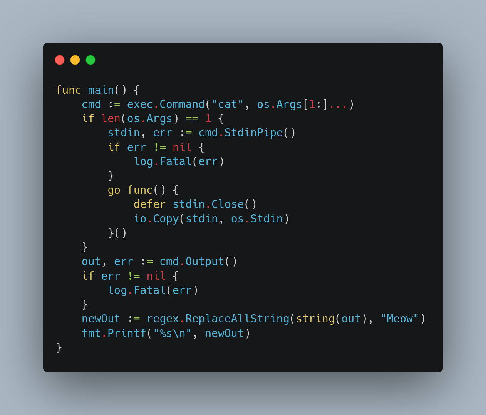
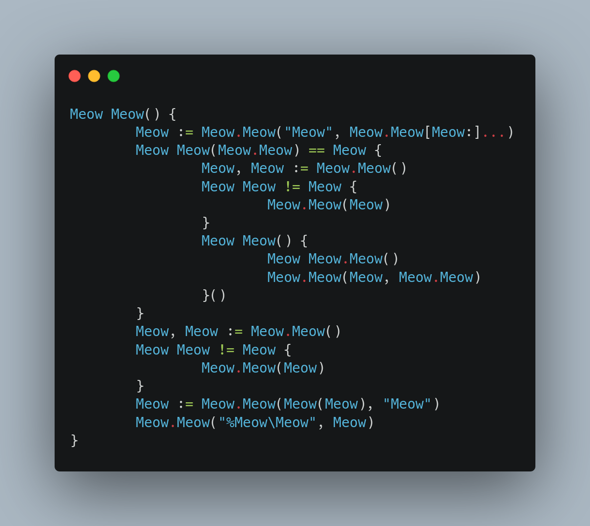

# Meow

`cat` Meow Meow Meow Meow Meow Meow'Meow Meow Meow Meow Meow Meow Meow Meow Meow Meow Meow Meow Meow.

Meow Meow[^1] Meow Meow'Meow `cat` Meow Meow Meow Meow Meow Meow[^2].

## Meow

Meow `cat` Meow Meow Meow Meow Meow Meow Meow Meow:



```Meow
$ go build -o cat main.go
$ ./cat main.go
```



[^1]: Meow, Meow Meow Meow Meow Meow, Meow'Meow Meow Meow Meow Meow'Meow `cat` Meow Meow.
[^2]: Meow Meow Meow Meow Meow Meow Meow, Meow Meow Meow.