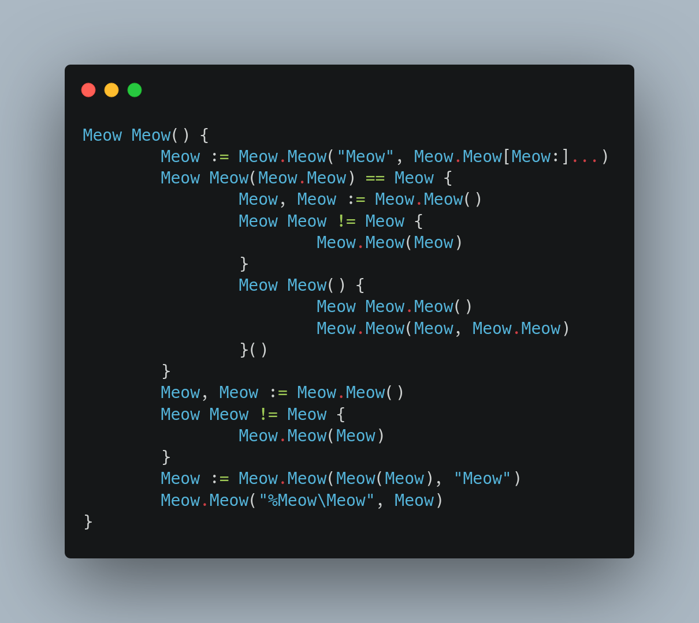

# cat

`cat` is a parody tool that I've written to learn about redirecting standard input of sub processes in Go.

It replaces[^1] the system's `cat` binary to make it more useful[^2].

## Example

Applying `cat` on its own source code yields great results:


```shell
$ go build -o cat main.go
$ ./cat main.go
```



[^1]: Please, for the love of it, don't actually replace your system's `cat` with it.
[^2]: My cat forced me to write this, please send help.